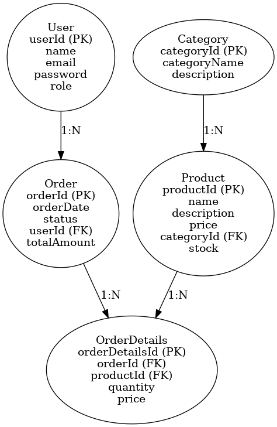
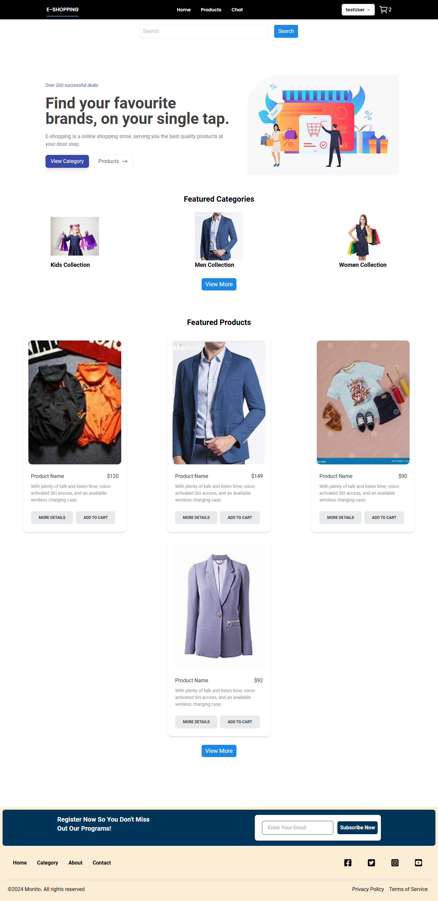
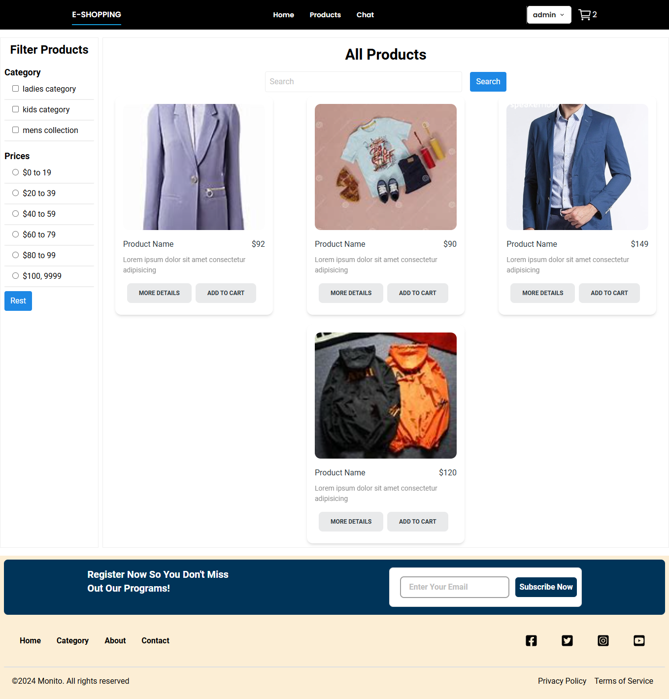
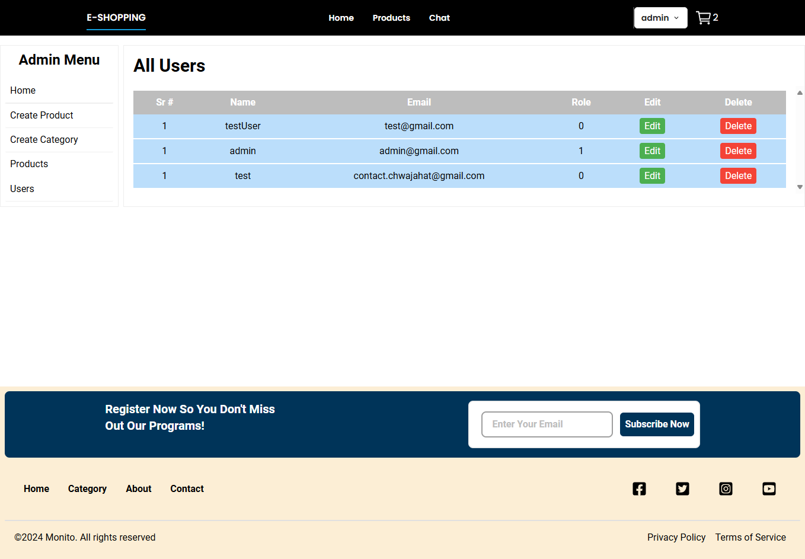
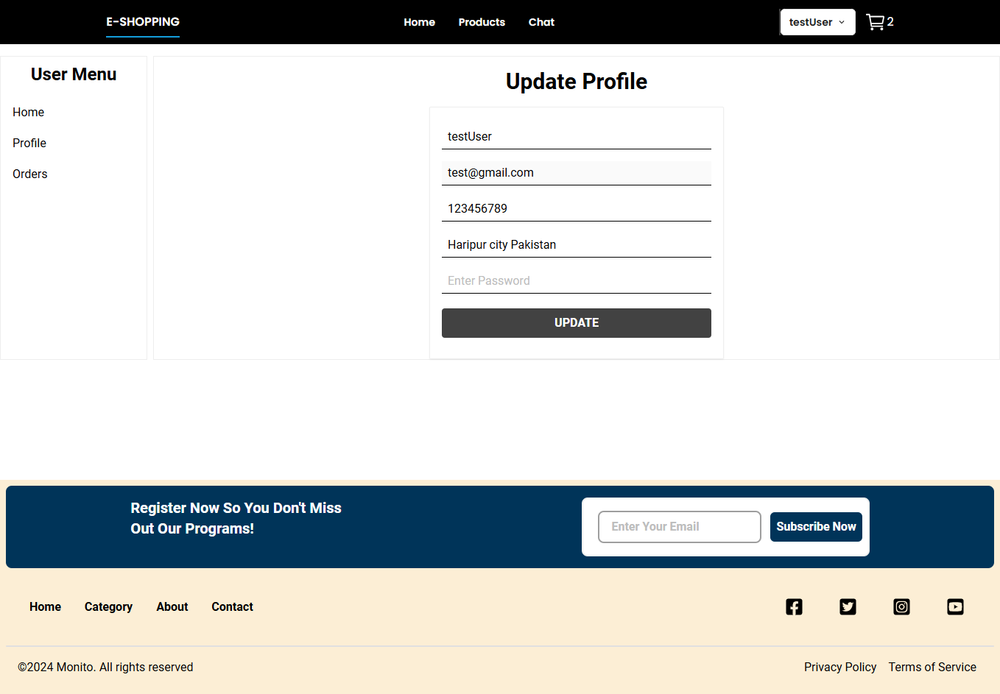
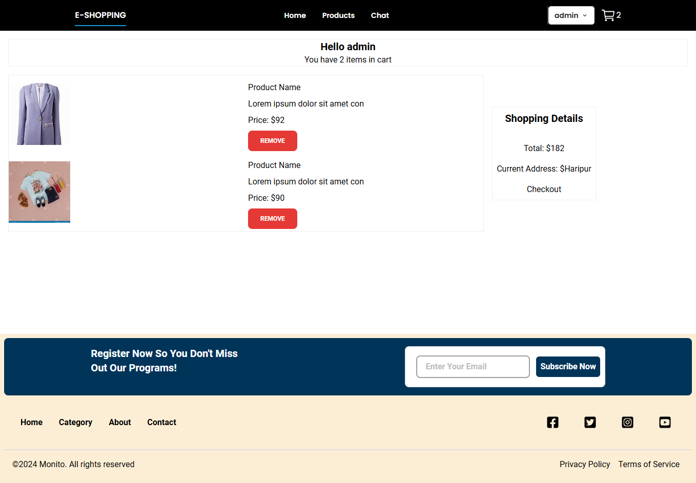

# E-commerce Web Application

## 📖 Table of Contents

- [Introduction](#introduction)
- [Features](#features)
- [Technologies Used](#technologies-used)
- [Installation](#installation)
- [Usage](#usage)
- [Project Structure](#project-structure)
- [Screenshots](#screenshots)
- [Contributing](#contributing)
- [License](#license)
- [Contact](#contact)
- [Note](#note)

## 📃 Introduction

Flashcards App is a full-stack web application built using the MERN stack (MongoDB, Express, React, Node.js). It allows users to create, read, update, and delete flashcards, and includes user authentication and authorization.

## 💡 Features

- User Authentication (Register/Login)
- Product Listing
- Product Detail Page
- Shopping Cart
- Order Management
- Admin Dashboard for managing products and orders

## ⚙️ Technologies Used

- **Frontend:**
  - React
  - Context API (for state management)
  - TailwindCSS

- **Backend:**
  - Node.js
  - Express.js
  - MongoDB (with Mongoose)

- **Tools and Libraries:**
  - JWT for authentication
  - Bcrypt for password hashing
  - Axios for HTTP requests
  - Concurrently for running frontend and backend servers

## 📩 Installation

To run this project locally, follow these steps:

1. **Clone the repository**:

   ```bash
   git clone https://github.com/wajaht-ali/Flashcards-app.git
   cd Flashcards-app
   ```

2. **Install dependencies**:

   ```bash
   # Install client dependencies
   cd client
   npm install

   # Install server dependencies
   cd ../server
   npm install
   ```

3. **Set up environment variables**:
   Create a `.env` file in the `server` directory and add the following:

   ```env
   PORT=5000
   MONGO_URI=your_mongodb_uri
   JWT_SECRET=your_jwt_secret
   ```

4. **Run the application**:

   ```bash
   # Run server
   cd server
   npm start

   # Run client
   cd ../client
   npm start
   ```

## 🔦 Usage

Once the application is running, open your browser and navigate to `http://localhost:3000` to start using the Flashcards App.

## 🗃️ Project Structure

```plaintext
Flashcards-app/
├── client
│   ├── public
│   └── src
│       ├── components
|            ├── Layout
|            ├── Pages
|            ├── Routes
│       ├── assets
│       ├── context
│       ├── styles
│       ├── App.js
│       └── index.js
├── server
│   ├── config
│   ├── controllers
│   ├── helpers
│   ├── models
│   ├── routes
│   ├── middleware
│   └── server.js
└── README.md
```

## ➕ Contributing

Contributions are welcome! Please fork the repository and create a pull request with your changes.

- Fork the repository
- Create a new branch (git checkout -b feature-branch)
- Commit your changes (git commit -am 'Add new feature')
- Push to the branch (git push origin feature-branch)
- Create a new Pull Request

## 📨 Contact

If you have any questions or need help, feel free to reach out to me at contact.chwajahat@gmail.com

## 📷 Screenshots
- ER Diagram
  

- Home Page
  

- Products Page
  

- Admin Dashbaord
  

- User Dashbaord
  

- Shopping Cart

## ⚠️ Note

- This Application is still under development, some important features are still being developed and tested locally, once it's clear I'll push them asap.
